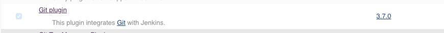
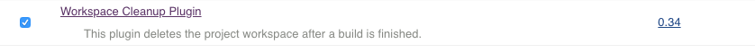
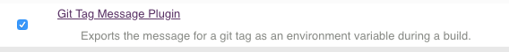
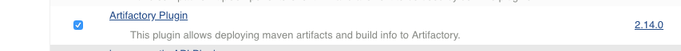

# Jenkins configurations

## Getting Familiar with Jenkins Console
When you login to jenkins for the first time, following is the screen you would see.

* On the left side of the screen, on top is the menu to  create new projects, to manage jenkins, to create users etc.
* Just below the menu is the build queue. All  jobs scheduled to run get added to the queue and would appear here.  
* Below build queue is the build executor status. This shows the status of the jobs being executed in real time.
* Bottom right of the page is the information about jenkins version displayed.

## Configuring Global Security
* Select  Manage Jenkins -> Configure Global Security
* Verify
  * checkbox for "Enable Security" is checked
  * From Security Realm,  "Jenkins own database" is selected
  * Authorization is set to "Logged in users can do anything"

Observe the configs  and verify as per the screenshot attached below

# Jenkins Plugins

 The real magic of Jenkins lies in its rich plugins eco system. This is how tools integrate with jenkins to build a CI workflow. You want to trigger jenkins jobs after every change going into git, you have a plugin for it. You want to send a notification to your developers on a successful or failed builds, you have a notification plugin. You want to use a tool to fetch or push the build artifacts, you have a plugin for it. This is how most of the tools talk to jenkins.

 In this tutorial, we are going to learn a simple process to install plugins. As part of this, we will end us installing a plugin which would help us integrate jenkins with our git repository.

### Exploring Plugins Configurations
 * From "Manage Jenkins", select  "Manage Plugins" option.  
 * On the Manage Plugins pane you would see the following tabs,
   * Updates
   * Available
   * Installed
   * Advanced
 

 Select "Installed" to view the list of the plugins which came pre installed with jenkins.

## Installing Plugins
  * From "Manage Plugins", select **Available** tab.
  * On the top-right corner you should see a filter box, start typing the search term in that box. we will need below plugins to be installed for our CI-CD setup.

* Git Plugin
  

* Workspace Cleanup Plugin
  

* Maven Plugin
  

* NodeJS Plugin
    

*  Go Plugin
  

*  Git Tag Plugin
  

*  Ssh Plugin
  

*  Artifactory Plugin
  

  ----