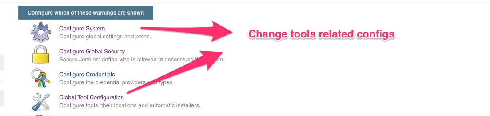
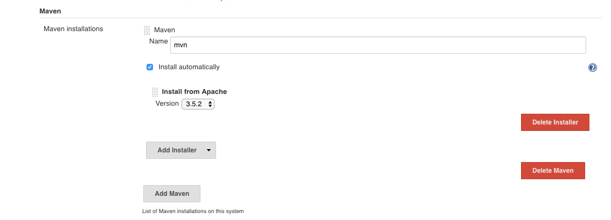
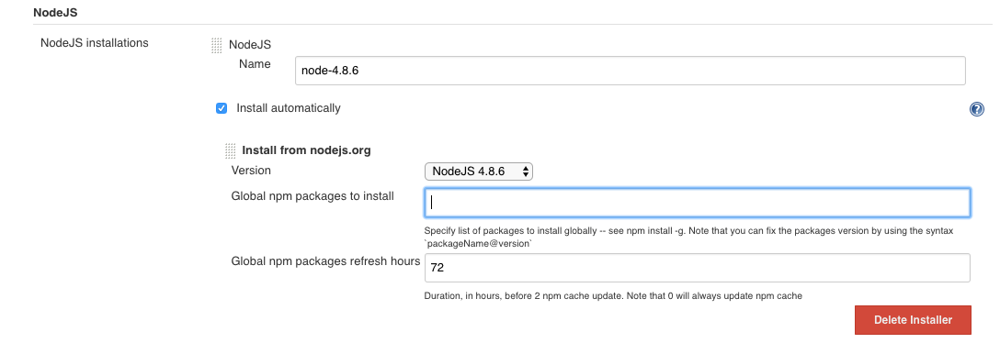

# Jenkins Tools configurations

Once you installed all plugins, we can go ahead to make required changes in configurations.

## Configuring Maven
* Go to section Maven
* Provide name for maven installation
* Select check box to install it automatically and select version to be installed.

## Configuring NodeJS
* Go to section NodeJS
* Provide name for nodejs installation
* Select check box to install it automatically and select version to be installed.
* You can provide names to install global modules, which very common for all services.

## Configuring Go
* Go to section Go
* Provide name for go installation
* Select check box to install it automatically and select version to be installed.

## Configuring SSH for remote host
* Go to section SSH remote hosts in **Configure Systems** setting.
* Provide host name for hosts to ssh.
* Select ssh port 22.
* We need to provide credentials for same. We can create credentials in **Configure Credentials** menu.
* Select check box to install it automatically and select version to be installed.

## Configuring Artifactory
* Provide the server id for Artifactory server.
* Provide URL of Artifactory server.
* Provide default credentials for Artifactory.
* once you added credentials check the connectivity, it will provide Artifactory version *(e.g 5.8.4)*

-----
