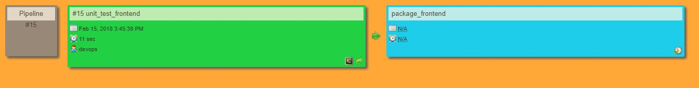
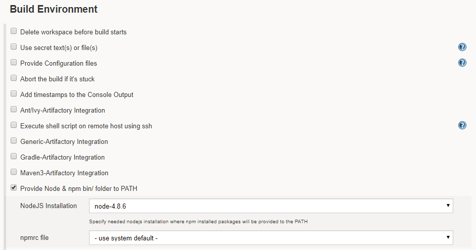
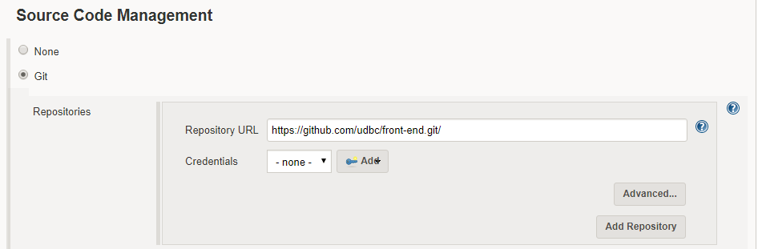
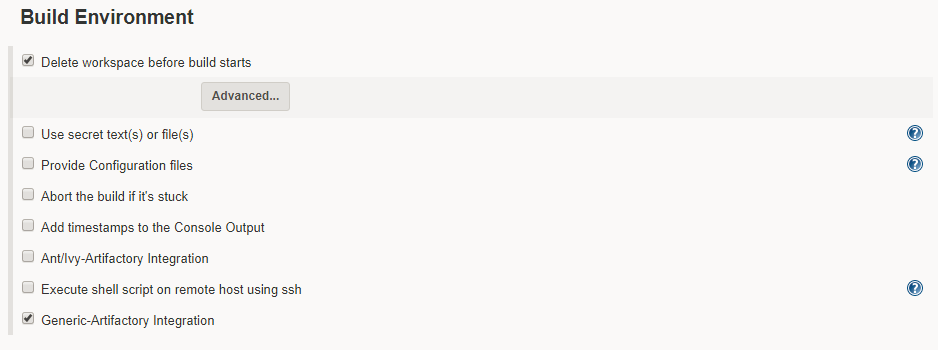

# Build pipeline for Front End
Front End pipeline contains two jobs.

* Unit Testing
* Packaging

## Job 1 (Unit Testing)

The purpose is to validate that each unit of the software performs as designed. unit testing successfully completed, Then the next step is packaging. Suppose unit testing failed, he doesn't perform packaging.

#### Source Code Management
The Source Code is available at the github.com.
You need to clone it by following url

    https://github.com/microservices-demo/front-end.git

In Build Trigger we have select GitHub hook trigger for GITScm polling.

Whatever is pushed to master i.e. github.com will immediately known by the  **Jenkins server**.

#### Build Environment
To Build the environment we required **NodeJS**

#### Build
To Build the Environment we need to install the **npm** you can install it by following Command.   

## Job 2 (Packaging)
After the successful completion of validation then we go for packaging. After packaging we deploy the package to Artifactory.

### Source Code Management

The Source Code is available at the github.com.
You need to clone it by following url

    https://github.com/udbc/front-end.git/

Once the unit test successfully completed then packages are Triggered.

### Build Environment
Before starting to build the environment we Delete workspace.

### Artifactory Configuration
Once the Unit test and Package are completed the we deploy these artifacts to Artifactory.

To download the Artifactory use the following url

    http://188.166.236.188.9081/artifactory

#### Build
To Build the Environment we need to install the **npm** you can install it by following Command.   

### Artifactory

Once everything is done then the packages are deploy to Artifactory.

