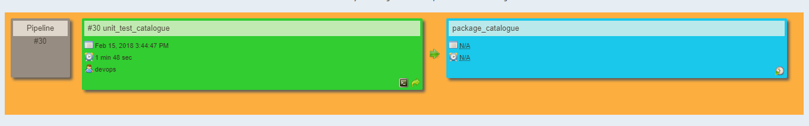
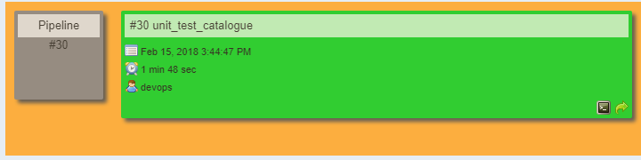
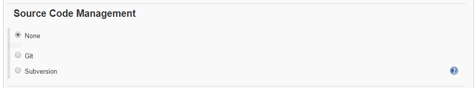
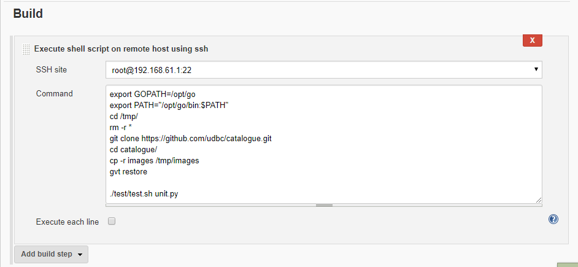
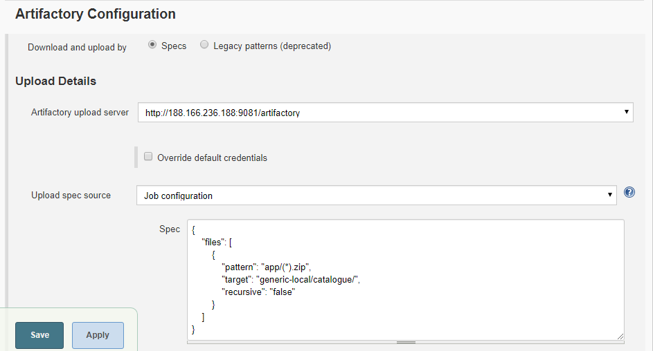
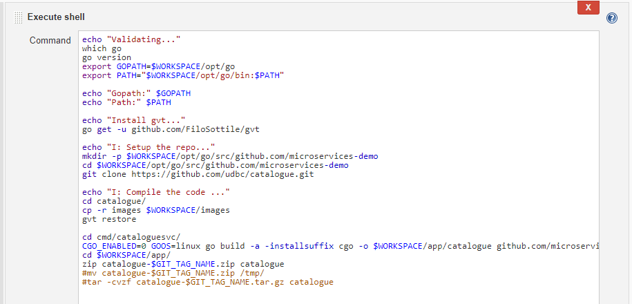

# Build pipeline for Catalogue
Catalogue pipeline contains two jobs.

* Unit Testing
* Packaging

 

## Job 1 (Unit Testing) 
Jenkins provides an out of box functionality for Junit, and provides a host of plugins for unit testing for other technologies. Unit test verify small block of code behaves as expected under a well-defined set of external conditions. Unit test aim to isolate the code under test. Once the unit testing is successful it goes to next job called packaging.

 

### General
the source code of this available on the github.com

use the following link to download project.

	git clone https://github.com/udbc/catalogue.git/

### Source Code Management
To get information related to source code management click on **unit_test-catalogue** and click on **configure**

In source code management we select option **None**
#

### Build Triggers

In **BUILD TRIGGERS** we select the option **Github hook trigger for GITScm polling** . This option states that whatever is triggered or pushed to master i.e.  github.com will immediately know by the jenkins server .
 

### Build

In **Build** Execute shell script on remote host using **ssh**

**command**

	export GOPATH=/opt/go
	export path="/opt/go/bin:$PATH"
	cd /tmp/
	rm -r *
	git clone https://github.com/udbc/catalogue.git/
	cd catalogue/
	cp -r images/catalogue/tmp/images
	gvt restore

	

### Post Build Actions
If unit test build successfully completed. Its trigger to the package build. suppose unit test build failed. it doesn't trigger package build.

## Job 2 (Package catalogue) 
 Once the unit test build completed. It goes to package build.

### Build Triggers

In **BUILD TRIGGERS** we select the option **Github hook trigger for GITScm polling** . This option states that whatever is triggered or pushed to master i.e.  github.com will immediately know by the jenkins server .

### Build

Once the Jenkins server gets triggered it start building the environment . It delete workspace before building the environment.

Once the packaging service is completed . We need to push the details of the package to the  Artifactory server with job configuration .

	spec:-
	{
    	"files": [
    	    {
    	        "pattern": "app/(*).zip",
    	        "target": "generic-local/catalogue/",
    	        "recursive": "false"
    	    }
    	]
	} 

In **Build** Execute shell script

	echo "Validating..."
	which go
	go version
	export GOPATH=$WORKSPACE/opt/go
	export PATH="$WORKSPACE/opt/go/bin:$PATH"
	
	echo "Gopath:" $GOPATH
	echo "Path:" $PATH
	
	echo "Install gvt..."
	go get -u github.com/FiloSottile/gvt
	
	echo "I: Setup the repo..."
	mkdir -p $WORKSPACE/opt/go/src/github.com/microservices-demo
	cd $WORKSPACE/opt/go/src/github.com/microservices-demo
	git clone https://github.com/udbc/catalogue.git
	
	echo "I: Compile the code ..."
	cd catalogue/
	cp -r images $WORKSPACE/images
	gvt restore
	
	cd cmd/cataloguesvc/
	CGO_ENABLED=0 GOOS=linux go build -a -installsuffix cgo -o $WORKSPACE/app/catalogue github.com/microservices-demo/catalogue/cmd/cataloguesvc
	cd $WORKSPACE/app/
	zip catalogue-$GIT_TAG_NAME.zip catalogue
	#mv catalogue-$GIT_TAG_NAME.zip /tmp/
	#tar -cvzf catalogue-$GIT_TAG_NAME.tar.gz catalogue

### Artifact Repository Browser

Once the packaging services deploy completed . To check artifact Repository Browser 

