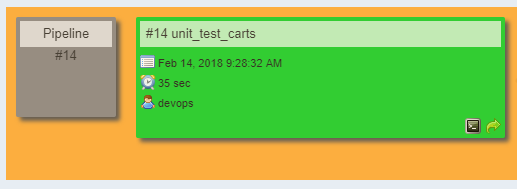
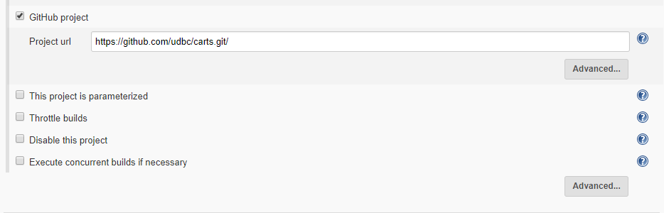
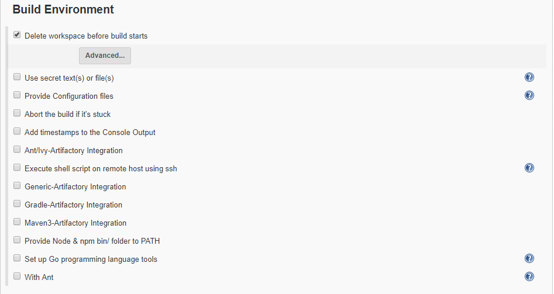
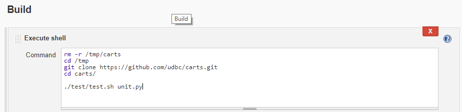
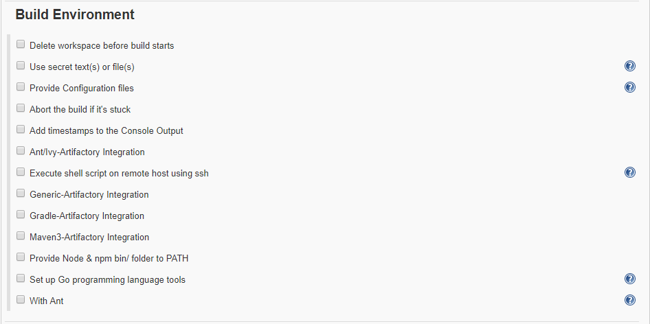
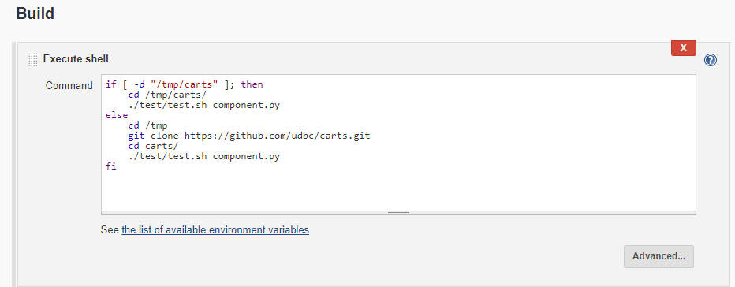
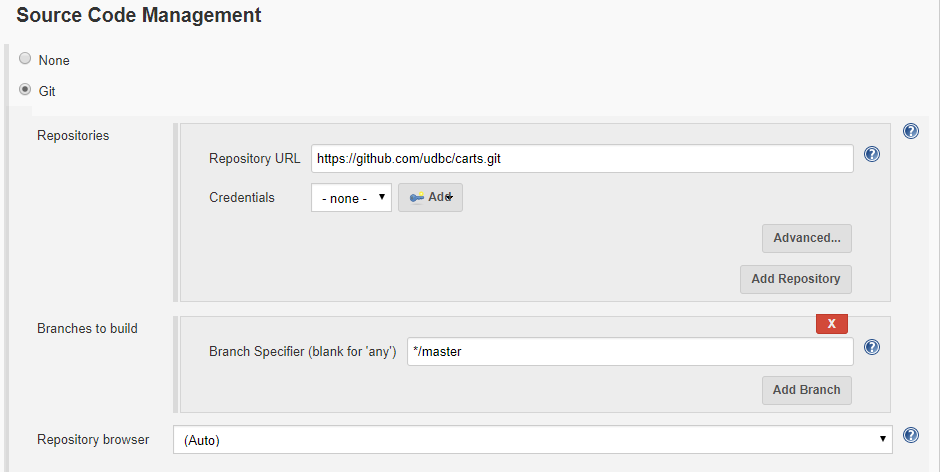
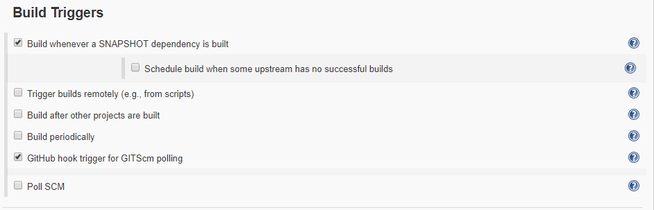
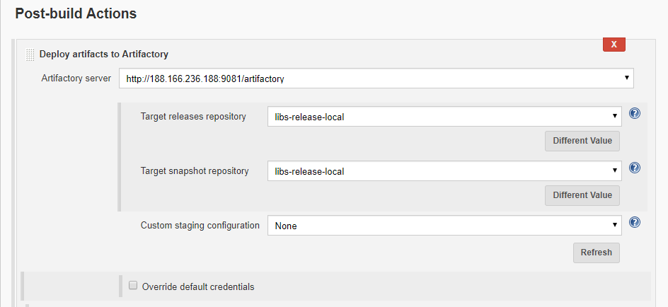

# Build Pipeline for Cart

  Pipeline for the Cart contains three jobs
  
* Unit Testing. 
* Component Testing
* Packages

## Job 1 (Unit testing)

  Jenkins provides an out of box functionality for Junit, and provides a host of plugins for unit testing for other technologies. Unit tests verify that a small block of code behaves as expected under a well-defined set of external conditions. Unit tests aim to isolate the code under test.
  Once the Unit testing is successful it goes to next job called _Component testing_

### General

The source Code of this project will be available on the github.com.

 Project url:

      https://github.com/udbc/carts.git/

### Source Code Management

To get the information related source code management click on the **unit_test_carts** and the click on **configure**

In Source Code Management we select the option **NONE**.

In **BUILD TRIGGERS** we select the option **GitHub hook trigger for GITScm polling** . This option states that whatever is triggered or pushed to the master i.e. github.com will immediately known by the jenkins server .

### Build Enviornment

Once the Jenkins server gets triggered it starts building the environment. It deletes the workspace before building the environment.

### Build

In this we are actually **cloning** are project and **running** the unit test module.

## Job 2 (Component Testing)

Integration tests exercise the interactions between different components of a system. Once the component test is passed successfully it move to _Packages_

### Source Code Management

To get the information related source code management click on the **component_test_carts** and the click on **configure**

In Source Code Management we select the option **NONE**.

In **BUILD TRIGGERS** we select the option **Build after other projects are built** . This option states that once the **unit_test_cart** is successfully done then only it can start the component testing.

### Build Enviornment

Once the Jenkins server gets triggered it starts building the environment.

### Build

In this we are actually **cloning** are project and **running** the component test module.

### Post-build Action

If the **unit test** and **component test** is successfully done then only it is triggered to the package build.

## Job 3 (Packages)

Once the Component test is passed it goes into the packages stage. The aim of packages is to depoly it to Artifactory.

### Source Code Management

To get the information related source code management click on the **package_carts** and the click on **configure**

In Source Code Management we select the option **Git**. It states the are repository is present on github.com

Repository url:-

    https://github.com/udbc/carts.git

In **BUILD TRIGGERS** we select the option **GitHub hook trigger for GITScm polling**. This option states that whatever is triggered or pushed to the master i.e. github.com will immediately known by the jenkins server .

### Build

TO build it successfully we have a file called **pom.xml** in which the source is present. The main goal is to _clean the compine package_ and to _skip the testing part_.

### Post-build Actions

This is the section where everything build earlier i.e. **unit_test_cart** and **component_test_carts** artifacts are deployed to the **Artifactory**. Here we need to define the _target release_ and _target snapshot_ needed for the Artifactory.

## ARTIFACTORY :-

This is where you will be able to see that the cart module have been deployed to the **Artifactory**.

